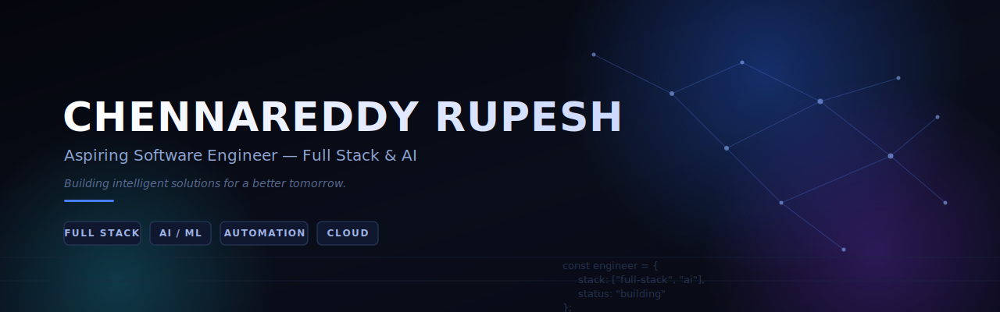

 

 

## 👋 About

I'm Rupesh, an aspiring Software Engineer focused on Full Stack development and AI. I have a solid foundation in Python, data structures, and the software development lifecycle, and I like building things that actually work end-to-end — from a FastAPI backend to an LLM-driven automation pipeline.

Most of what's below came out of coursework, hackathons, and a habit of automating small annoyances with `n8n` and a handful of APIs. Still early in the journey, still shipping.

 

| 🎓 Education | 📍 Location | 💻 Focus | 🤖 Interest |
|:---:|:---:|:---:|:---:|
| B.Tech CSE (AI/ML) VIT · 2022–2026 | Chennai, India | Full Stack + AI | AI / ML / Automation |

 

## ⚙️ Skills & Technologies

<table>
<tr>
<td valign="top" width="50%">

**Frontend & Design**

 

HTML · CSS · Responsive Design · Figma · Framer

</td>
<td valign="top" width="50%">

**Backend & APIs**

Python · FastAPI · REST APIs · Server-side Logic · Node.js (basic)

</td>
</tr>
<tr>
<td valign="top">

**Databases**

MongoDB · MySQL · PostgreSQL · Data Modeling · Query Writing

</td>
<td valign="top">

**Tools & Version Control**

 

Git · GitHub · VS Code · Linux · n8n Workflow Automation

</td>
</tr>
<tr>
<td valign="top">

**Cloud & Deployment**

AWS S3 · AWS Lambda (concepts) · Serverless Architecture (basic)

</td>
<td valign="top">

**AI & Machine Learning**

Machine Learning · NLP · Generative AI · LLM APIs · RAG Concepts · BERT · LLM Workflows · AI Automation

</td>
</tr>
</table>

**Core skills:** Problem Solving · Analytical Thinking · Adaptability · Communication · Team Collaboration

Items marked (basic) / (concepts) reflect working or conceptual familiarity, not production depth.

 

## 💼 Experience

<table>
<tr>
<td>

**Team Lead — Design Team**
*Next Gen Cloud, VIT University* · 2023 – 2024

- Led the design team in conceptualizing and creating high-impact posters and promotional materials for marketing and advertising campaigns.
- Successfully organized and coordinated major university events and cross-functional team operations.
- Enhanced team workflow, strengthened communication, and drove creative problem-solving under tight event deadlines.

</td>
</tr>
</table>

 

## 🚀 Featured Projects

<table>
<tr>
<td width="50%" valign="top">

**Stage-Aware Attention Routing**

Developed a router to mitigate LLM hallucinations by classifying queries into four cognitive stages using a BERT-based classifier, steering model behavior via stage-prompting and direct attention-head modulation through forward hooks.

`Python` `BERT` `NLP` `LLMs` `Attention Mechanisms`

`[ View Code ]` `[ Case Study ]`

</td>
<td width="50%" valign="top">

**24/7 AI Receptionist for Healthcare**

Autonomous voice-based AI receptionist built with n8n, VAPI.io, and Google Gemini to automate appointment scheduling and cut down administrative effort and patient wait times.

`n8n` `VAPI.io` `Google Gemini` `AI Automation` `Voice AI`

`[ View Code ]` `[ Live Demo ]`

</td>
</tr>
<tr>
<td width="50%" valign="top">

**AI-Powered Academic Quiz Generator**

End-to-end pipeline that preprocesses lecture documents, extracts context using OpenAI models, and auto-generates quizzes directly in Google Forms.

`Python` `OpenAI` `NLP` `Automation` `Google Forms`

`[ View Code ]`

</td>
<td width="50%" valign="top">

**Automated AI Email Digest System**

Summarization pipeline using n8n and the Gmail API for collection, preprocessing, topic extraction, categorization, and automated daily communication summaries.

`n8n` `Gmail API` `AI` `NLP` `Automation`

`[ View Code ]`

</td>
</tr>
<tr>
<td width="50%" valign="top">

**AI-Powered Recruitment Platform**

Full-stack automated interview system using Next.js and ElevenLabs for candidate screening, with MongoDB storing candidate statistics. Fine-tuned LLMs generate tailored interview questions per job category.

`Next.js` `ElevenLabs` `MongoDB` `LLMs` `Full Stack` `AI`

`[ View Code ]` `[ Live Demo ]`

</td>
<td width="50%" valign="top">

**Real-Time Financial Transaction Anomaly Detection**

Real-time anomaly detection using Isolation Forest to flag suspicious banking transactions from individual spending patterns, with a two-step verification flow to cut false positives.

`Python` `Machine Learning` `Isolation Forest` `Feature Engineering` `Data Analysis`

`[ View Code ]`

</td>
</tr>
<tr>
<td width="50%" valign="top">

**Automated Traffic Signal Prioritization for Emergency Vehicles**

IoT system using Arduino and RFID to prioritize emergency vehicles at signals, demonstrating real-time data processing and automation control.

`Arduino` `RFID` `IoT` `Automation`

`[ View Code ]`

</td>
<td width="50%" valign="top">

</td>
</tr>
</table>

`[ View Code ]` / `[ Live Demo ]` are placeholders — swap in real links once repos are public.

 

## 🏆 Achievements

### 🥇 Consolidated Winner — Agentica 2.0 · 2026
Built an AI-based financial document processing system to parse bank statements, extract structured data, and classify transactions into labeled categories.

 

| Rank | Event | Year | Highlight |
|:---:|---|:---:|---|
| 🥈 2nd Place | AIGNITE 2.0 AI/ML Hackathon | 2026 | Built an AI-Powered Screening Bot using LLM workflows and automation pipelines. |
| 🏅 4th Place | VoiceHack | 2026 | Built an ML model on a medical call dataset with a high F1-score for ticket classification. |
| 🏅 4th Place | Datasprint 3.0 Data Science Hackathon | 2026 | Data preprocessing, feature engineering, and ML modeling across multiple rounds. |

 

## 📜 Certifications

| Certification | Issuer |
|---|---|
| Cybersecurity Essentials | Cisco |
| Networking Essentials | Cisco |
| Generative AI Professional | Oracle |
| MERN Full Stack Development | ETHNUS |
| AWS Cloud Foundations | AWS |
| Web Design | Bharathidasan University |

 

## 🎓 Education

**B.Tech CSE w/s AIML** — Vellore Institute of Technology · 2022 – 2026
**Higher Secondary** — Velammal Institute of Technology · 2020 – 2022

 

## 📊 GitHub Activity

 

## 📫 Let's Connect

 

Build. Learn. Solve. Repeat.

